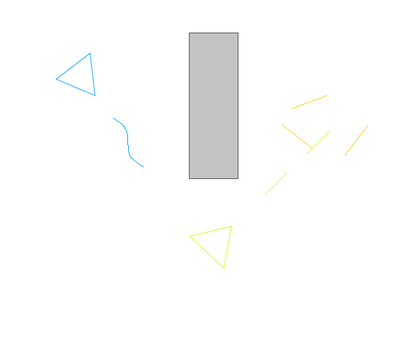

# triag
Triangle Tag Game (WIP)

# Description
This is an attempt to recreate a very simple but very fun
game from the 90s.  The intent of the game is to tag the most
number of other triangles without being tagged yourself.

Each triangle has a special patter to tag the other triangles
where each pattern might require a different strategy or work
better in different situations.

Each triangle can either be a computer bot or a player.  The 
players can play on the same keyboard.  Each player uses a
separate collection of keys to navigate the triangle as well as
tag other triangles.

This is a mockup of what the game should look like:
